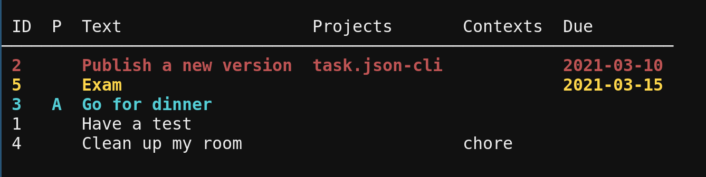

# task.json-cli

[](https://npmjs.org/package/task.json-cli)
[](https://github.com/DCsunset/task.json-cli/blob/master/package.json)

Command line task management app for [task.json](https://github.com/DCsunset/task.json) written in Node.js.

## Screenshots



## Installation

```
npm i -g task.json-cli
```

## Environment Variables

* `TASK_JSON_PATH`: the path of task.json data (default: `$HOME/.task.json`)


## Usage
<!-- usage -->
```sh-session
$ npm install -g task.json-cli
$ tj COMMAND
running command...
$ tj (-v|--version|version)
task.json-cli/5.0.0 linux-x64 node-v16.9.1
$ tj --help [COMMAND]
USAGE
  $ tj COMMAND
...
```
<!-- usagestop -->

## Commands
<!-- commands -->
* [`tj add TEXT`](#tj-add-text)
* [`tj autocomplete DIR`](#tj-autocomplete-dir)
* [`tj config`](#tj-config)
* [`tj detail NUM...`](#tj-detail-num)
* [`tj do NUM...`](#tj-do-num)
* [`tj erase NUM...`](#tj-erase-num)
* [`tj help [COMMAND]`](#tj-help-command)
* [`tj login`](#tj-login)
* [`tj ls`](#tj-ls)
* [`tj lsctx`](#tj-lsctx)
* [`tj lsnum`](#tj-lsnum)
* [`tj lsproj`](#tj-lsproj)
* [`tj modify [NUM...]`](#tj-modify-num)
* [`tj restore`](#tj-restore)
* [`tj rm NUM...`](#tj-rm-num)
* [`tj sync`](#tj-sync)
* [`tj undo NUM...`](#tj-undo-num)

## `tj add TEXT`

Add a new task

```
USAGE
  $ tj add TEXT

ARGUMENTS
  TEXT  text of the task

OPTIONS
  -D, --deps=deps          dependencies (use #)
  -P, --priority=priority  priority (A-Z)
  -c, --contexts=contexts  one or more contexts
  -d, --due=due            due date
  -h, --help               show CLI help
  -p, --projects=projects  one or more projects

EXAMPLES
  $ tj add Hello World
  $ tj add "Hello World" -p test -p greeting -c test --due 2020-12-24
  $ tj add Hello World -p test -D t1 -D t2
```

_See code: [src/commands/add.ts](https://github.com/DCsunset/task.json-cli/blob/v5.0.0/src/commands/add.ts)_

## `tj autocomplete DIR`

Install completion file

```
USAGE
  $ tj autocomplete DIR

ARGUMENTS
  DIR  Install completion files to specific directory

OPTIONS
  -h, --help  show CLI help
  --zsh       Install zsh completion

EXAMPLE
  $ tj autocomplete --zsh ~/.zsh_completion
```

_See code: [src/commands/autocomplete.ts](https://github.com/DCsunset/task.json-cli/blob/v5.0.0/src/commands/autocomplete.ts)_

## `tj config`

Modify or show config

```
USAGE
  $ tj config

OPTIONS
  -h, --help           show CLI help
  -r, --reset          reset all configurations
  -s, --server=server  set server address
  -t, --token=token    set token for login

EXAMPLES
  $ tj config  # show config
  $ tj config --reset  # reset all config
  $ tj config --server "http://localhost:3000"  # set config
  $ tj config --server ""  # reset server
```

_See code: [src/commands/config.ts](https://github.com/DCsunset/task.json-cli/blob/v5.0.0/src/commands/config.ts)_

## `tj detail NUM...`

Show task details

```
USAGE
  $ tj detail NUM...

ARGUMENTS
  NUM...  tasks to show details of

OPTIONS
  -h, --help  show CLI help

EXAMPLES
  $ tj detail t1
  $ tj detail t1 d1
```

_See code: [src/commands/detail.ts](https://github.com/DCsunset/task.json-cli/blob/v5.0.0/src/commands/detail.ts)_

## `tj do NUM...`

Mark tasks as done

```
USAGE
  $ tj do NUM...

ARGUMENTS
  NUM...  mark specific tasks as done

OPTIONS
  -h, --help  show CLI help

EXAMPLES
  $ tj do t1
  $ tj do t1 t2
```

_See code: [src/commands/do.ts](https://github.com/DCsunset/task.json-cli/blob/v5.0.0/src/commands/do.ts)_

## `tj erase NUM...`

Erase removed tasks

```
USAGE
  $ tj erase NUM...

ARGUMENTS
  NUM...  erase specific removed tasks

OPTIONS
  -f, --force  force erasing without confirmation
  -h, --help   show CLI help

EXAMPLE
  $ tj erase r1
```

_See code: [src/commands/erase.ts](https://github.com/DCsunset/task.json-cli/blob/v5.0.0/src/commands/erase.ts)_

## `tj help [COMMAND]`

display help for tj

```
USAGE
  $ tj help [COMMAND]

ARGUMENTS
  COMMAND  command to show help for

OPTIONS
  --all  see all commands in CLI
```

_See code: [@oclif/plugin-help](https://github.com/oclif/plugin-help/blob/v3.2.3/src/commands/help.ts)_

## `tj login`

Log into the server

```
USAGE
  $ tj login

OPTIONS
  -h, --help               show CLI help
  -p, --password=password  log in with password

EXAMPLES
  $ tj login  # interactive input the password
  $ tj login --password "xxx"  # log in with password
```

_See code: [src/commands/login.ts](https://github.com/DCsunset/task.json-cli/blob/v5.0.0/src/commands/login.ts)_

## `tj ls`

List tasks

```
USAGE
  $ tj ls

OPTIONS
  -D, --deps                   show dependent tasks and dependencies [default: false]
  -P, --priorities=priorities  filter tasks by priorities (A-Z)
  -T, --types=types            [default: todo] filter tasks by types (todo, done, removed, all) [default: todo]
  -c, --contexts=contexts      filter tasks by specific contexts
  -h, --help                   show CLI help
  -p, --projects=projects      filter tasks by specific projects
  --and-contexts               filter contexts using AND operator instead of OR
  --and-projects               filter projects using AND operator instead of OR

EXAMPLES
  $ tj ls
  $ tj ls -p test
  $ tj ls -c ""  # list tasks without contexts
  $ tj ls -p projA -p projB  # list tasks with projA or projB
```

_See code: [src/commands/ls.ts](https://github.com/DCsunset/task.json-cli/blob/v5.0.0/src/commands/ls.ts)_

## `tj lsctx`

List contexts

```
USAGE
  $ tj lsctx

OPTIONS
  -T, --types=types  [default: todo] list contexts of tasks of types (todo, done, removed, all) [default: todo]
  -h, --help         show CLI help

EXAMPLES
  $ tj lsctx
  $ tj lsctx -T all
```

_See code: [src/commands/lsctx.ts](https://github.com/DCsunset/task.json-cli/blob/v5.0.0/src/commands/lsctx.ts)_

## `tj lsnum`

List Numbers

```
USAGE
  $ tj lsnum

OPTIONS
  -T, --types=types  [default: todo] list numbers of tasks of types (todo, done, removed, all) [default: todo]
  -h, --help         show CLI help

EXAMPLES
  $ tj lsnum
  $ tj lsnum -T all
  $ tj lsnum -T done
```

_See code: [src/commands/lsnum.ts](https://github.com/DCsunset/task.json-cli/blob/v5.0.0/src/commands/lsnum.ts)_

## `tj lsproj`

List projects

```
USAGE
  $ tj lsproj

OPTIONS
  -T, --types=types  [default: todo] list projects of tasks of types (todo, done, removed, all) [default: todo]
  -h, --help         show CLI help

EXAMPLES
  $ tj lsproj
  $ tj lsproj -T all
```

_See code: [src/commands/lsproj.ts](https://github.com/DCsunset/task.json-cli/blob/v5.0.0/src/commands/lsproj.ts)_

## `tj modify [NUM...]`

Modify tasks (use a single empty string to delete the field or filter tasks without it)

```
USAGE
  $ tj modify [NUM...]

ARGUMENTS
  NUM...  modify specific tasks

OPTIONS
  -D, --deps=deps                        modify dependencies
  -P, --priority=priority                modify priority (A-Z)

  -T, --types=types                      filter tasks by types (todo, done, removed, all) [default: all (if no number
                                         specified)

  -c, --contexts=contexts                modify contexts (overwrite all)

  -d, --due=due                          modify due date

  -h, --help                             show CLI help

  -p, --projects=projects                modify projects (overwrite all)

  -t, --text=text                        modify text

  --and-contexts                         filter contexts using AND operator instead of OR

  --and-projects                         filter projects using AND operator instead of OR

  --filter-contexts=filter-contexts      filter tasks by specific contexts

  --filter-priorities=filter-priorities  filter tasks by priority (A-Z)

  --filter-projects=filter-projects      filter tasks by specific projects

EXAMPLES
  $ tj modify t1 -d 2020-12-12
  $ tj modify d2 d3 -p projA -p projB
  $ tj modify t1 -t "New description"
  $ tj modify t2 -p ""  # delete projects field
  $ tj modify -T todo --filter-projects projA -p projB # Modify all projA to projB
```

_See code: [src/commands/modify.ts](https://github.com/DCsunset/task.json-cli/blob/v5.0.0/src/commands/modify.ts)_

## `tj restore`

Undo the last modification using the bak file

```
USAGE
  $ tj restore

OPTIONS
  -f, --force  force overwriting without confirmation
  -h, --help   show CLI help

EXAMPLES
  $ tj restore
  $ tj restore -f
```

_See code: [src/commands/restore.ts](https://github.com/DCsunset/task.json-cli/blob/v5.0.0/src/commands/restore.ts)_

## `tj rm NUM...`

Delete tasks

```
USAGE
  $ tj rm NUM...

ARGUMENTS
  NUM...  delete specific tasks

OPTIONS
  -h, --help  show CLI help

EXAMPLES
  $ tj rm t1
  $ tj rm d1
```

_See code: [src/commands/rm.ts](https://github.com/DCsunset/task.json-cli/blob/v5.0.0/src/commands/rm.ts)_

## `tj sync`

Sync local task.json with server

```
USAGE
  $ tj sync

OPTIONS
  -d, --download  download task.json from server to overwrite the local one
  -f, --force     overwrite without confirmation
  -h, --help      show CLI help
  -u, --upload    upload local task.json to overwrite the one on server

EXAMPLES
  $ tj sync
  $ tj sync --upload
  $ tj sync --download --force
```

_See code: [src/commands/sync.ts](https://github.com/DCsunset/task.json-cli/blob/v5.0.0/src/commands/sync.ts)_

## `tj undo NUM...`

Undo tasks

```
USAGE
  $ tj undo NUM...

ARGUMENTS
  NUM...  undo specific done or removed tasks

OPTIONS
  -h, --help  show CLI help

EXAMPLES
  $ tj undo d1 d2
  $ tj undo r1 r2  # restore removed tasks
```

_See code: [src/commands/undo.ts](https://github.com/DCsunset/task.json-cli/blob/v5.0.0/src/commands/undo.ts)_
<!-- commandsstop -->
