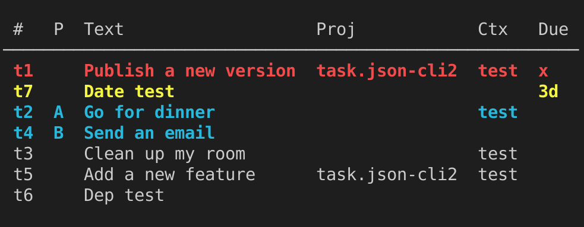

# task.json-cli

[](https://npmjs.org/package/task.json-cli)
[](https://github.com/DCsunset/task.json-cli/blob/master/package.json)

Command line task management app for [task.json](https://github.com/DCsunset/task.json) written in Node.js.

## Screenshots



## Features

* User-friendly command-line interface
* Highlighting for urgent tasks
* Filtering tasks by various field
* Sync with remote task.json-server (with end-to-end encryption support)
* Workspace support
* ZSH autocompletion

## Installation

```
npm i -g task.json-cli
```

## Environment Variables

* `TASK_JSON_PATH`: the path of task.json data (default: `$HOME/.config/task.json`)

## Migration from v7 to v8

Backup your old data first.
Then use the script in <https://github.com/task-json/task.json/tree/master/scripts> to migrate your data
from task.json format v1 to v2.

You'll also need to use task.json-server v2 if you want to sync data with a server.

## Migration from v5 to v6

Move the data from `$HOME/.task.json` to `$HOME/.config/task.json`.

## License

AGPL-3.0 License.

Full copyright notice:

    Copyright (C) 2020-2022  DCsunset

    This program is free software: you can redistribute it and/or modify
    it under the terms of the GNU Affero General Public License as published by
    the Free Software Foundation, either version 3 of the License, or
    (at your option) any later version.

    This program is distributed in the hope that it will be useful,
    but WITHOUT ANY WARRANTY; without even the implied warranty of
    MERCHANTABILITY or FITNESS FOR A PARTICULAR PURPOSE.  See the
    GNU Affero General Public License for more details.

    You should have received a copy of the GNU Affero General Public License
    along with this program.  If not, see <https://www.gnu.org/licenses/>.

